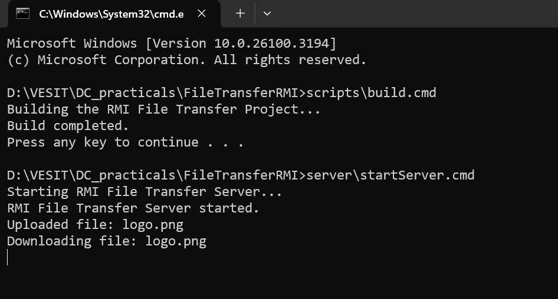
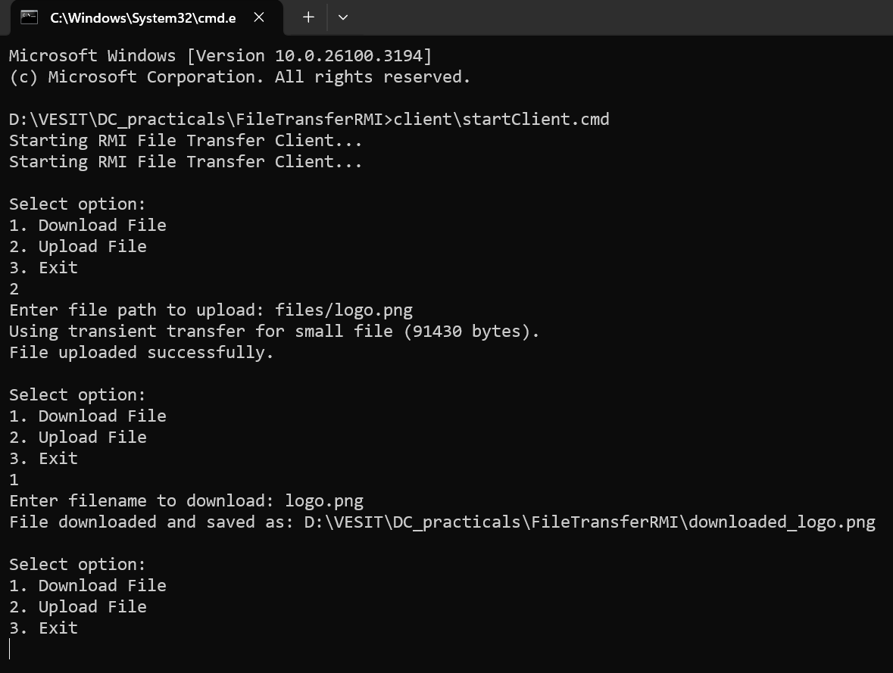
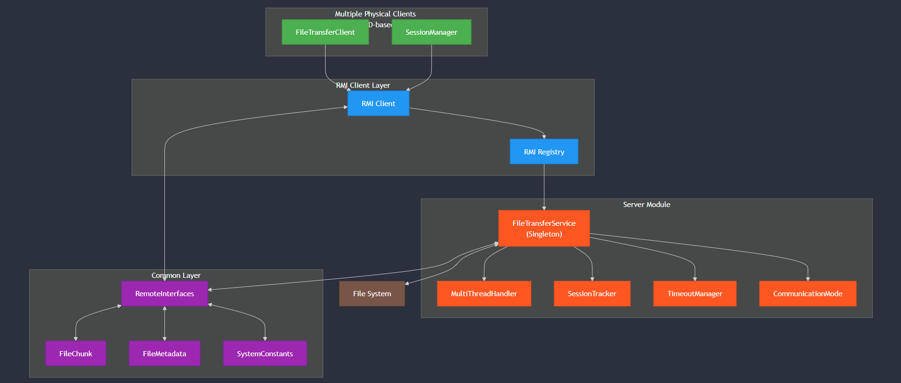
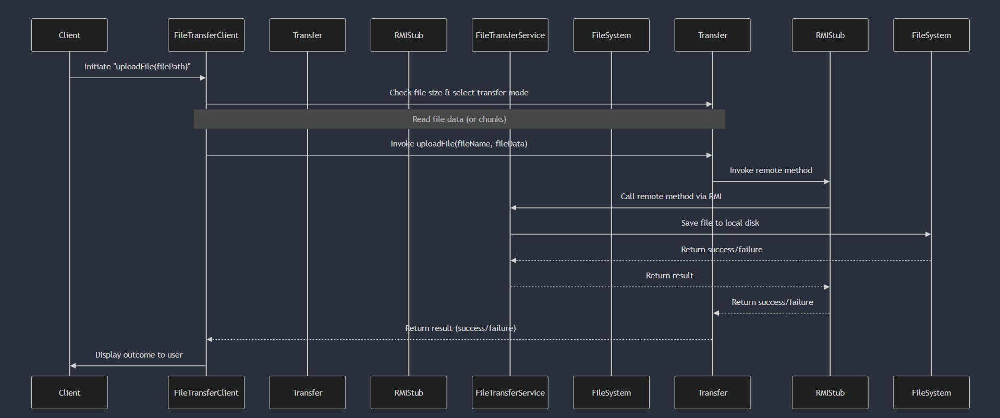

# RMI File Transfer System

## Overview

This project is a Java-based RMI file transfer system that supports stateful file transfers with session management, multi-threading, and both persistent and transient file transfer modes. The system is designed to operate with multiple physical clients via a CMD interface and a centralized server that handles file transfer requests.

## Features

- **Stateful Client/Server Design:** Maintains session data for resuming interrupted transfers.
- **Singleton Server Instance:** A single instance of `FileTransferService` handles all client requests.
- **Persistent & Transient Communication:** Uses persistent transfer (with chunking) for large files and transient transfer for small files.
- **Synchronous Request/Reply Model:** Ensures remote method invocations are executed at most once.
- **Multi-threaded Server:** Supports concurrent client requests.
- **Extensible Design:** Future enhancements include caching, adaptive timeouts, and load balancing.

## Directory Structure

```plaintext
FileTransferRMI/
├── client/
│   ├── src/                # Client source code
│   ├── bin/                # Compiled client classes
│   └── startClient.cmd     # Script to launch the client
├── server/
│   ├── src/                # Server source code
│   ├── bin/                # Compiled server classes
│   └── startServer.cmd     # Script to start the server
├── common/
│   ├── src/                # Shared interfaces and classes
│   └── bin/                # Compiled common classes
├── docs/                   # Design documents, requirements, user manual
├── tests/                  # Unit and integration tests
└── scripts/
    ├── build.cmd           # Build script for the project
    └── deploy.cmd          # Deployment script for environment setup
```

## Build Instructions

1. Open a command prompt in the `FileTransferRMI` root directory.
2. Run the build script:
   ```batch
   scripts\build.cmd
   ```
   

## Run Instructions

1. **Start the Server:**

   - Navigate to the `server` directory and run:
     ```batch
     server\startServer.cmd
     ```


2. **Start the Client(s):**
   - Open a command prompt in the `client` directory and run:
     ```batch
     client\startClient.cmd
     ```
   - For multiple physical clients, run the client script on different machines or in multiple command prompt windows.



## Architecture Diagram

Below is the architecture diagram for the RMI File Transfer System, illustrating all major components and their interactions:



## Sequence Diagram

The sequence diagram below illustrates the flow for a typical file upload operation:



## Design Documentation

For a detailed design overview, please refer to the `docs/design.txt` file, which covers:

- Client/Server design principles (stateful communication, session management)
- Server creation semantic (singleton instance)
- Communication modes (persistent vs. transient)
- Synchronous request/reply model and call semantics
- Concurrency handling and multi-threading
- Future enhancements such as caching and load balancing

## Testing

Unit and integration tests are available in the `tests/` directory:

- `tests/clientTests/ClientTestSuite.java`
- `tests/serverTests/ServerTestSuite.java`
- `tests/integrationTests/FileTransferIntegrationTest.java`
